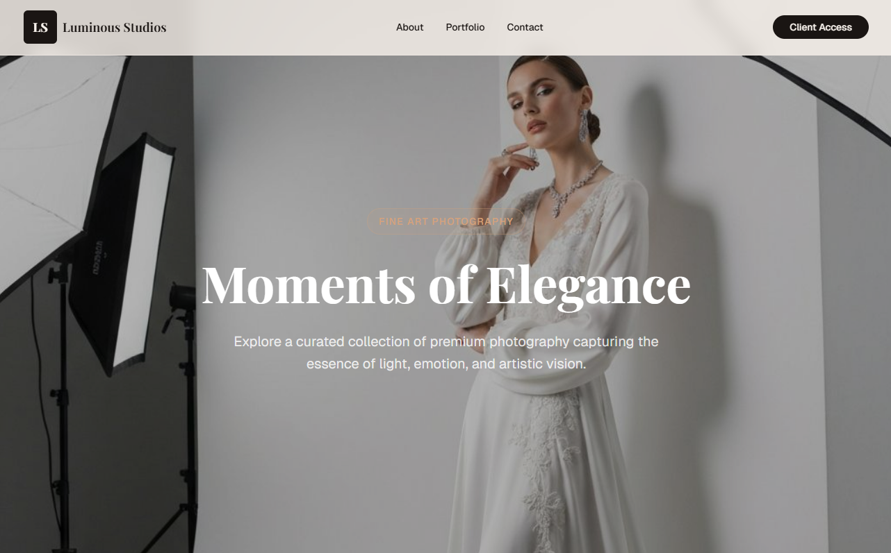
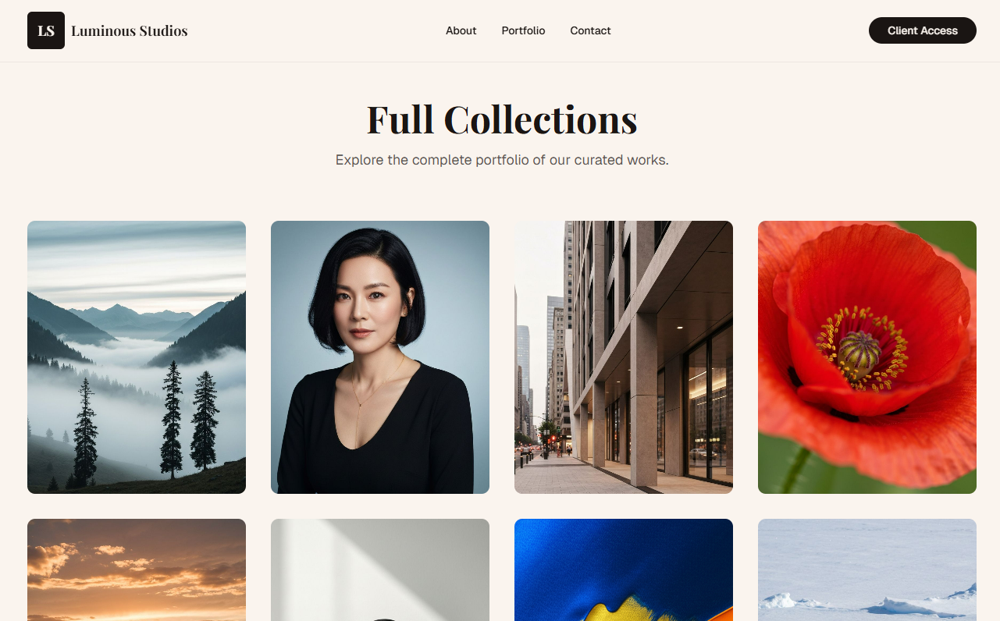
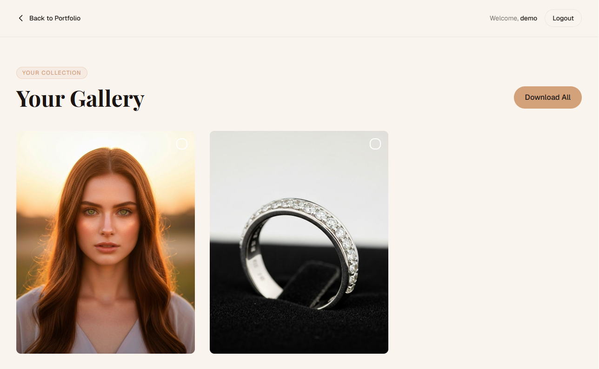
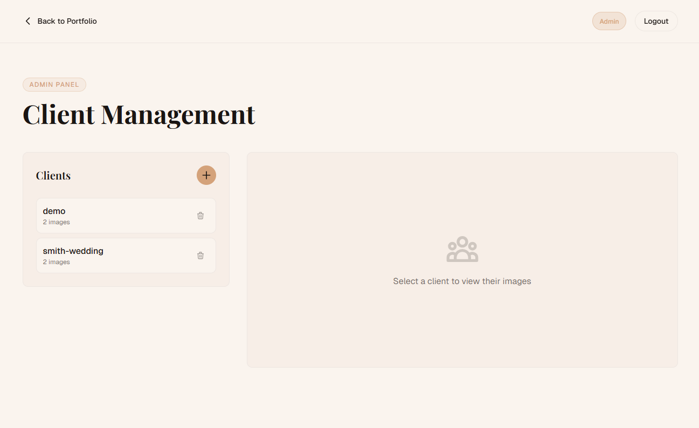

# 📸 Photography Portfolio Website

A modern, elegant, and responsive photography portfolio website built with Next.js, TypeScript, and Tailwind CSS. Showcase your photography work with style and professionalism.

## ✨ Features

- 🎨 **Modern Design** - Clean and elegant UI with smooth animations
- 📱 **Fully Responsive** - Perfect viewing experience on all devices
- ⚡ **Lightning Fast** - Built with Next.js for optimal performance
- 🖼️ **Image Gallery** - Beautiful photo grid with lightbox functionality
- 🎭 **Category Filtering** - Organize photos by categories/genres
- 💫 **Smooth Animations** - Engaging transitions and hover effects
- 🔍 **Image Optimization** - Next.js Image component for optimal loading

## 🛠️ Built With

- **[Next.js](https://nextjs.org/)** - React framework for production
- **[TypeScript](https://www.typescriptlang.org/)** - Type-safe JavaScript
- **[Tailwind CSS](https://tailwindcss.com/)** - Utility-first CSS framework
- **[shadcn/ui](https://ui.shadcn.com/)** - Re-usable component library
- **[Lucide Icons](https://lucide.dev/)** - Beautiful icon set
- **PostCSS** - CSS post-processing

## 📋 Prerequisites

Before you begin, ensure you have the following installed:
- Node.js (v18 or higher)
- npm, yarn, or pnpm

## 🔧 Installation

1. **Clone the repository**
```bash
git clone https://github.com/kaan0d/Photography-Portfolio-Website.git
cd Photography-Portfolio-Website
```

2. **Install dependencies**
```bash
# Using pnpm (recommended)
pnpm install

# Or using npm
npm install

# Or using yarn
yarn install
```

3. **Set up environment variables** (if needed)
```bash
cp .env.example .env.local
```

Edit `.env.local` with your configuration:
```env
NEXT_PUBLIC_SITE_URL=https://your-domain.com
NEXT_PUBLIC_SITE_NAME=Your Photography
```

4. **Run the development server**
```bash
pnpm dev
# or
npm run dev
# or
yarn dev
```

5. **Open your browser**
Navigate to [http://localhost:3000](http://localhost:3000)

## 📁 Project Structure

```
Photography-Portfolio-Website/
├── app/                    # Next.js app directory
│   ├── page.tsx           # Home page
│   ├── about/             # About page
│   ├── gallery/           # Gallery pages
│   └── contact/           # Contact page
├── components/            # React components
│   ├── ui/               # shadcn/ui components
│   ├── Header.tsx        # Navigation header
│   ├── Footer.tsx        # Footer component
│   ├── Gallery.tsx       # Photo gallery component
│   └── ContactForm.tsx   # Contact form
├── hooks/                # Custom React hooks
├── lib/                  # Utility functions
├── public/               # Static assets
│   ├── images/          # Photography images
│   └── icons/           # Icons and logos
├── styles/              # Global styles
│   └── globals.css      # Global CSS
├── next.config.mjs      # Next.js configuration
├── tailwind.config.ts   # Tailwind CSS configuration
└── tsconfig.json        # TypeScript configuration
```

## 🎨 Customization

### Adding Your Photos

1. Place your images in the `public/images/` directory
2. Update the gallery data in `lib/gallery-data.ts`:

```typescript
export const photos = [
  {
    id: 1,
    src: '/images/photo1.jpg',
    title: 'Sunset Mountains',
    category: 'landscape',
    description: 'Beautiful sunset over the mountains'
  },
  // Add more photos...
];
```

### Customizing Colors

Edit `tailwind.config.ts` to change the color scheme:

```typescript
export default {
  theme: {
    extend: {
      colors: {
        primary: '#your-color',
        secondary: '#your-color',
      }
    }
  }
}
```

### Modifying Content

- **About Page**: Edit `app/about/page.tsx`
- **Contact Info**: Edit `components/ContactForm.tsx`
- **Navigation**: Edit `components/Header.tsx`
- **Footer**: Edit `components/Footer.tsx`

## 🌐 Deployment

### Deploy to Vercel (Recommended)

1. Push your code to GitHub
2. Visit [Vercel](https://vercel.com)
3. Import your repository
4. Deploy with one click!

[](https://vercel.com/new/clone?repository-url=https://github.com/kaan0d/Photography-Portfolio-Website)

### Deploy to Netlify

```bash
# Install Netlify CLI
npm install -g netlify-cli

# Deploy
netlify deploy --prod
```

### Build for Production

```bash
pnpm build
pnpm start
```

## 📸 Screenshots

### Home Page


### Gallery


### Client


### Admin


## 🎯 Features in Detail

### Image Gallery
- Grid layout with responsive columns
- Lazy loading for optimal performance
- Lightbox for full-size image viewing
- Category filtering
- Smooth transitions and animations

### Contact Form
- Form validation
- Email integration (optional)
- Success/error messages
- Spam protection

### SEO Optimization
- Meta tags for social sharing
- Open Graph tags
- Structured data
- Sitemap generation
- Optimized images

## 🔌 Integrations

### Email Service (Optional)
To enable contact form functionality, you can integrate with:
- [EmailJS](https://www.emailjs.com/)
- [SendGrid](https://sendgrid.com/)
- [Resend](https://resend.com/)

Example with EmailJS:
```typescript
import emailjs from '@emailjs/browser';

const sendEmail = (formData) => {
  emailjs.send(
    'YOUR_SERVICE_ID',
    'YOUR_TEMPLATE_ID',
    formData,
    'YOUR_PUBLIC_KEY'
  );
};
```

### Analytics (Optional)
Add Google Analytics or other tracking:
```typescript
// app/layout.tsx
import { Analytics } from '@vercel/analytics/react';

export default function RootLayout({ children }) {
  return (
    <html>
      <body>
        {children}
        <Analytics />
      </body>
    </html>
  );
}
```

## 🧪 Testing

```bash
# Run tests (if configured)
pnpm test

# Type checking
pnpm type-check

# Linting
pnpm lint
```

## 🤝 Contributing

Contributions are welcome! Here's how you can help:

1. Fork the repository
2. Create a feature branch (`git checkout -b feature/AmazingFeature`)
3. Commit your changes (`git commit -m 'Add some AmazingFeature'`)
4. Push to the branch (`git push origin feature/AmazingFeature`)
5. Open a Pull Request

## 📝 License

This project is licensed under the MIT License - see the [LICENSE](LICENSE) file for details.

## 🙏 Acknowledgments

- Design inspiration from modern photography portfolios
- Built with love for the photography community
- Thanks to all open-source contributors

## 📧 Contact

Kaan - [@kaan0d](https://github.com/kaan0d)

Project Link: [https://github.com/kaan0d/Photography-Portfolio-Website](https://github.com/kaan0d/Photography-Portfolio-Website)

## 💡 Tips for Photographers

1. **Image Optimization**: Always compress your images before uploading
2. **Consistent Naming**: Use a consistent naming convention for your files
3. **Alt Text**: Add descriptive alt text for accessibility and SEO
4. **Regular Updates**: Keep your portfolio fresh with new work
5. **Categories**: Organize photos into logical categories
6. **Quality Over Quantity**: Show your best work only

## ⚡ Performance Tips

- Use Next.js Image component for automatic optimization
- Implement lazy loading for images
- Enable caching strategies
- Compress images (use tools like TinyPNG)
- Use WebP format when possible
- Minimize CSS and JavaScript

## 🐛 Known Issues

No known issues at this time. If you find a bug, please [open an issue](https://github.com/kaan0d/Photography-Portfolio-Website/issues).

---

**Made with 📸 and ❤️ by [Kaan](https://github.com/kaan0d)**

*Showcase your art, share your vision.*
